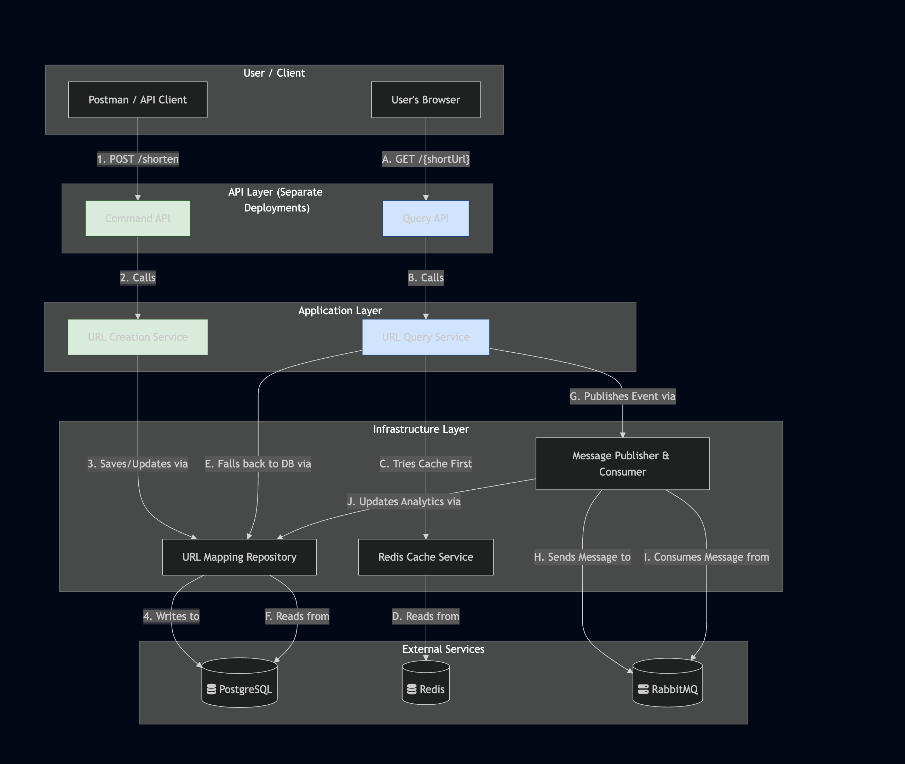
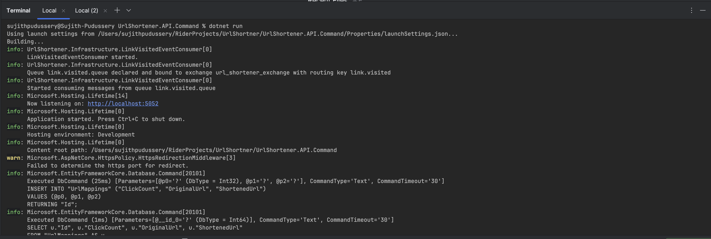
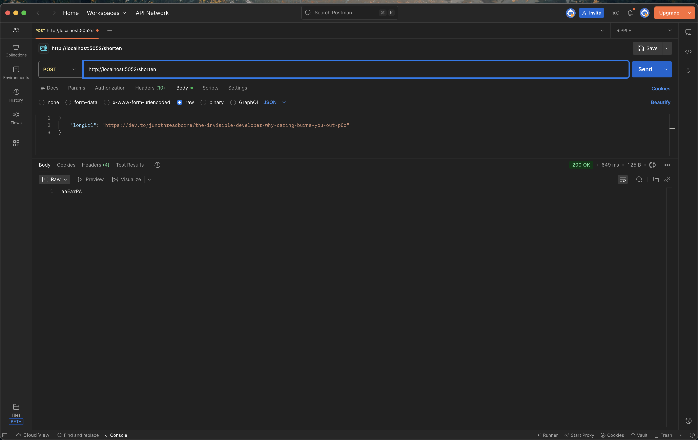
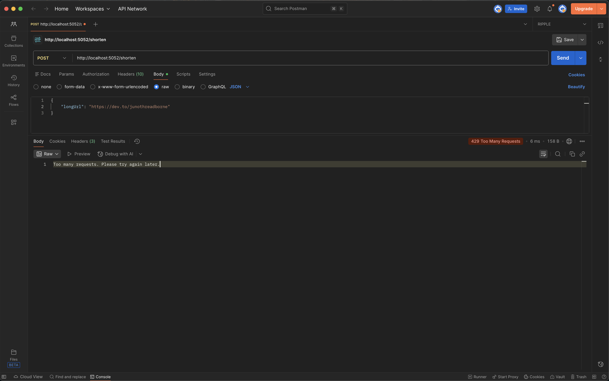
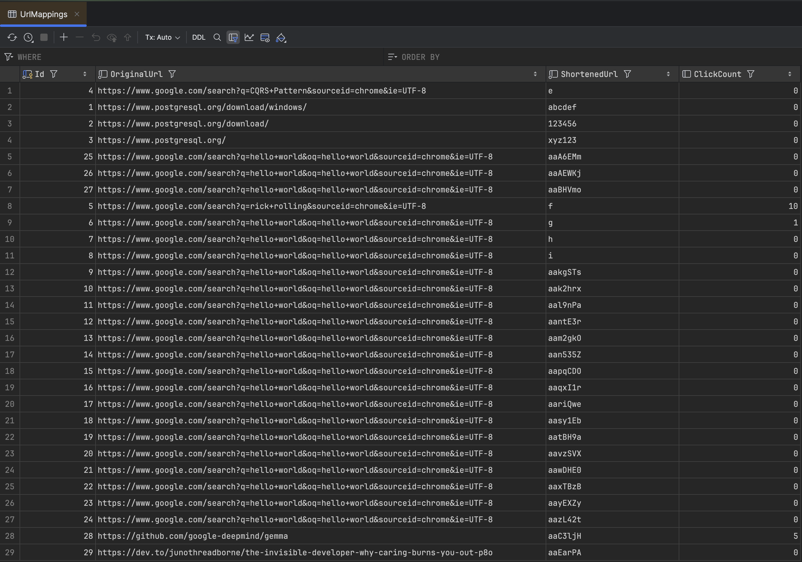
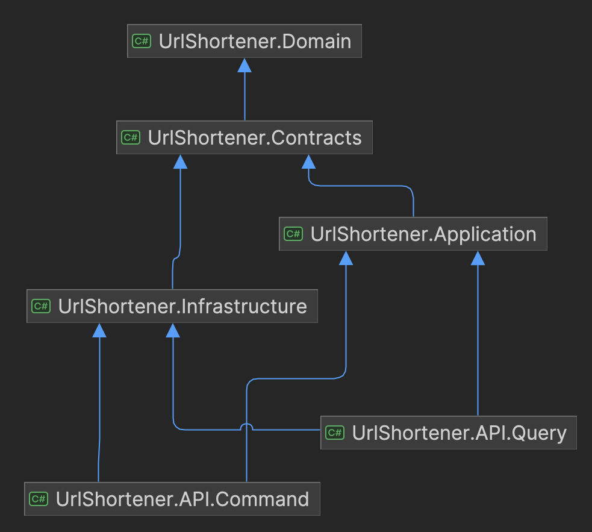
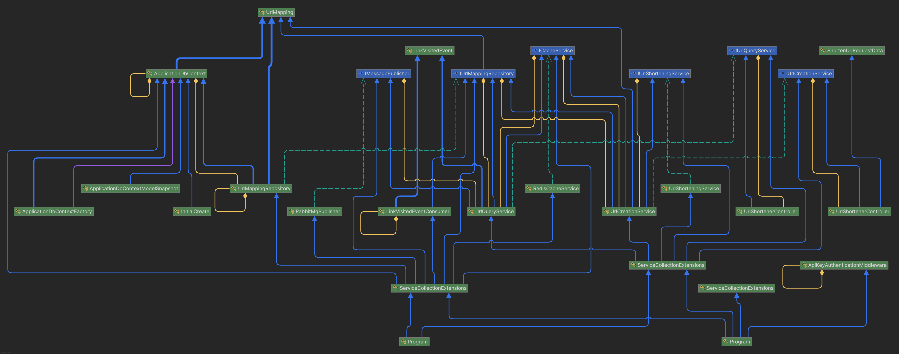

# SaaS-Ready URL Shortener API

This project is a high-performance, multi-tenant URL shortener API built with ASP.NET Core, following a microservice-style CQRS architecture. It demonstrates several advanced backend development concepts designed for scalability and maintainability.

## Table of Contents
- [High-Level Concept](#high-level-concept)
- [Architecture Overview](#architecture-overview)
- [Key Features](#key-features)
- [Getting Started](#getting-started)
  - [Prerequisites](#prerequisites)
  - [1. Start Infrastructure Services](#1-start-infrastructure-services)
  - [2. Configure User Secrets](#2-configure-user-secrets)
  - [3. Apply Database Migrations](#3-apply-database-migrations)
  - [4. Run the APIs](#4-run-the-apis)
- [Process Flow & Screenshots](#process-flow--screenshots)
  - [1. Running the Services](#1-running-the-services)
  - [2. Creating a Short URL](#2-creating-a-short-url)
  - [3. Rate Limiting](#3-rate-limiting)
  - [4. Database Storage & Analytics](#4-database-storage--analytics)
- [Future Enhancements](#future-enhancements)
- [Architectural Decisions and Reflections](#architectural-decisions-and-reflections)
  - [The Dependency Rule (Clean Architecture)](#the-dependency-rule-clean-architecture)
  - [Separating Commands and Queries (CQRS)](#separating-commands-and-queries-cqrs)
  - [Trade-offs and Compromises](#trade-offs-and-compromises)

## High-Level Concept

The goal of this project is to build a backend service similar to Bit.ly, focusing on a "Leg Up" architecture that separates high-frequency read operations from write operations. This ensures that URL redirection is lightning-fast while still capturing valuable analytics data asynchronously.

## Architecture Overview

The solution is structured using Clean Architecture principles, physically separating the Command and Query responsibilities into two distinct, independently deployable API services.



*   **Command API:** Handles URL creation (`POST /shorten`). Secured by API Key and Rate Limiting.
*   **Query API:** Handles URL redirection (`GET /{shortUrl}`). Highly optimized for reads, using a cache-first approach.
*   **Message Broker (RabbitMQ):** Decouples analytics processing from the user's redirect request.
*   **Cache (Redis):** Provides a lightning-fast, in-memory lookup for short URLs to avoid hitting the database on reads.
*   **Database (PostgreSQL):** The persistent source of truth for URL mappings and analytics data.

## Key Features

*   **CQRS (Command Query Responsibility Segregation):** Physically separated into two microservices for independent scaling.
*   **Clean Architecture:** Solution is layered into Domain, Application, Infrastructure, and API projects.
*   **High-Performance Caching:** Utilizes a Redis cache-aside pattern for sub-10ms response times.
*   **Asynchronous Analytics:** Publishes events to RabbitMQ, which are consumed by a background service to update a click counter in PostgreSQL.
*   **Non-Predictable Short URLs:** A bijective function shuffles sequential database IDs into unique, non-predictable, fixed-length (7-character) short codes.
*   **API Key Authentication:** Secures the write endpoint using custom ASP.NET Core middleware.
*   **Dynamic Rate Limiting:** Implements tier-based rate limiting ("free-tier", "pro-tier") based on the provided API key.

## Getting Started

### Prerequisites

*   [.NET 9.0 SDK](https://dotnet.microsoft.com/download/dotnet/9.0) (or newer)
*   [Docker Desktop](https://www.docker.com/products/docker-desktop/)
*   A running PostgreSQL instance (you can also run this in Docker)

### 1. Start Infrastructure Services

This project requires Redis and RabbitMQ. Start them using Docker:

```bash
# Start Redis
docker run -d --name some-redis -p 6379:6379 redis

# Start RabbitMQ with management UI
docker run -d --name some-rabbit -p 5672:5672 -p 15672:15672 rabbitmq:3-management
```

### 2. Configure User Secrets

The Command API requires API keys for authentication. Navigate to the Command API project and set them up:

```bash
cd UrlShortener.API.Command
dotnet user-secrets init
dotnet user-secrets set "ApiKeys:MyFreeUserApiKey_abcde" "free-tier"
dotnet user-secrets set "ApiKeys:MyProUserApiKey_12345" "pro-tier"
```

### 3. Apply Database Migrations

Ensure your `appsettings.Development.json` in `UrlShortener.API.Command` has the correct PostgreSQL connection string. Then, run the migration from the solution root:

```bash
dotnet ef database update --project UrlShortener.Infrastructure --startup-project UrlShortener.API.Command
```

### 4. Run the APIs

Open two separate terminals.

**Terminal 1 (Command API):**
```bash
cd UrlShortener.API.Command
dotnet run
```
*(The Command API will be running on http://localhost:5052)*

**Terminal 2 (Query API):**
```bash
cd UrlShortener.API.Query
dotnet run
```
*(The Query API will be running on http://localhost:5053)*

## Process Flow & Screenshots

### 1. Running the Services

Both the Command and Query APIs are run in separate terminals.



### 2. Creating a Short URL

Send a `POST` request to the Command API.

**Request:**
```bash
curl -X POST "http://localhost:5052/shorten" \
-H "Content-Type: application/json" \
-H "X-Api-Key: MyFreeUserApiKey_abcde" \
-d '{"longUrl": "https://www.google.com/search?q=asp.net+core+cqrs"}'
```
**Response:** A 7-character short URL string.



### 3. Rate Limiting

After exceeding the request limit for an API key (e.g., 10 requests for the free tier), you will receive a `429 Too Many Requests` error.



### 4. Database Storage & Analytics

The created URL mapping is stored in PostgreSQL. The `ClickCount` is updated asynchronously by the background service.



## Future Enhancements

This project provides a solid architectural foundation. Future enhancements to elevate it to a production-ready application would include:

*   **Automated Testing:** Create dedicated test projects for Unit and Integration tests using frameworks like xUnit and Moq to ensure code quality and reliability.
*   **Containerize the Entire Application:** Create a `docker-compose.yml` file to define and run the entire application stack (both APIs, PostgreSQL, Redis, RabbitMQ) with a single command.
*   **Structured Logging:** Implement a robust logging library like **Serilog** to write structured, queryable logs, and configure sinks for different environments (e.g., console, file, Seq).
*   **Full User Management:** Implement ASP.NET Core Identity for user registration, login, and the ability for users to generate and manage their own API keys.

## Architectural Decisions and Reflections

For this project, I wanted to move beyond a simple monolithic structure and implement an architecture that mirrors the patterns used in modern, scalable, and maintainable systems. My goal was to demonstrate a strong understanding of **CQRS (Command Query Responsibility Segregation)** and **Clean Architecture**.

### The Dependency Rule (Clean Architecture)

I structured the solution into distinct layers (`Domain`, `Contracts`, `Application`, `Infrastructure`, and the two `API` projects) to enforce a strict dependency rule: dependencies must always point inwards, toward the `Domain`.


*The project dependency diagram, showing how all dependencies point towards the core `Domain` and `Contracts`.*

The intent here was to create a system where the core business logic (`Application` and `Domain`) is completely independent of the implementation details (`Infrastructure`) and the delivery mechanism (`API`). This makes the application easier to test, maintain, and evolve over time. For example, we could swap out PostgreSQL for a different database in the `Infrastructure` layer with zero changes to the `Application` or `Domain` layers.

### Separating Commands and Queries (CQRS)

The core of the architecture is the physical separation of "writes" (Commands) and "reads" (Queries).

*   The **`UrlShortener.API.Command`** project is solely responsible for creating new short URLs.
*   The **`UrlShortener.API.Query`** project is solely responsible for handling high-speed redirections.

This separation allowed me to optimize each side for its specific task. The Query API is built for speed, using a Redis cache to bypass the database whenever possible. The Command API is built for consistency and security, handling authentication and rate limiting.


*A detailed look at the type dependencies, illustrating the flow of data and control in both the Command and Query paths.*

### Trade-offs and Compromises

While I tried to adhere as closely as possible to industry standards, building a portfolio project involves making pragmatic choices.

*   **Shared Database:** In a large-scale, "purist" CQRS implementation, the Command and Query sides might have entirely separate databases (e.g., a normalized SQL DB for writes and a denormalized document DB for reads). For this project, I made the pragmatic decision to use a single PostgreSQL database for both, as this is a common and effective approach for many real-world applications and simplifies the infrastructure.
*   **Shared `Infrastructure` Project:** Similarly, both the Command and Query APIs reference the same `Infrastructure` project. In a true microservices environment, these might be completely separate, even duplicated, to ensure total independence. I chose a shared `Infrastructure` project to reduce code duplication for this project's scale.

My goal was to build a project that is architecturally sound and demonstrates advanced concepts, while remaining manageable and focused. I believe this new approach strikes a good balance, showcasing a deep understanding of the patterns and the practical trade-offs involved in applying them.
